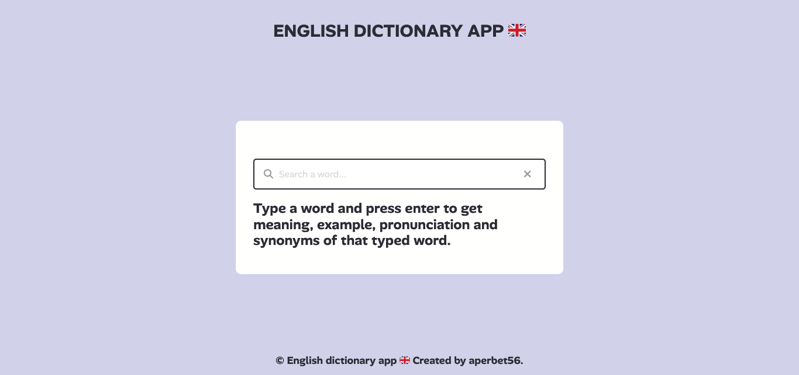

## ENGLISH DICTIONARY APP 🇬🇧

## Le challenge

Construction d'une application : dictionnaire anglais. L'internaute doit taper un mot (en anglais) et appuyer sur la touche Entrée pour obtenir la signification, un exemple, la prononciation et les synonymes du mot tapé.

## Démonstration

Lien vers le projet : https://aperbet56.github.io/english_dictionnary_app/

## Projet développé avec

- Utilisation des balises sémantiques HTML5
- CSS
- Flexbox
- Animations CSS
- Page web responsive
- Utilisation d'un normaliseur : le fichier normalize.css
- Free dictionary API : https://dictionaryapi.dev/
- JavaScript
- Code JavaScript commenté
- Desktop first
